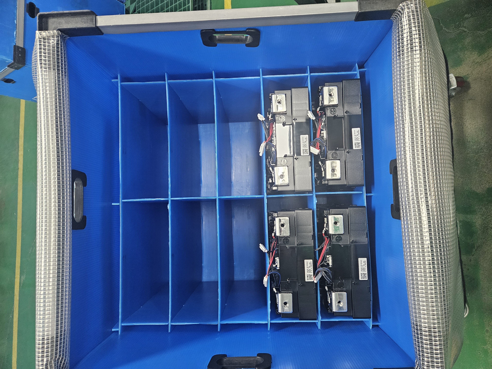

# iBox Inspector — 박스 칸별 제품 유무 검사기

파란색 분할 박스(격자 칸)의 각 칸에 제품이 들어 있는지 자동으로 검사하는
프로그램입니다. **YOLOv8 객체검출**로 제품을 찾고, 박스 격자(ROI)에 매핑하여
칸별로 **있음/없음**을 판정합니다. 이미지 파일 검사(CLI)와 실시간 카메라를 모두
지원하며 **GUI**를 제공합니다.



## 동작 방식
1. **검출**: YOLOv8 이 입력 이미지/프레임에서 제품(`product`) 박스를 검출
2. **격자 매핑**: `config/grid.yaml` 의 박스 4모서리 + 행/열 수로 칸을 원근 분할,
   각 검출 박스 중심이 어느 칸인지 계산
3. **판정**: 칸별 제품 검출 여부로 있음(녹색 O) / 없음(빨강 X) 판정
4. **출력**: 오버레이 이미지 + 콘솔 표 + JSON, 또는 GUI 실시간 표시

> 학습된 모델(`models/best.pt`)이 아직 없으면 사전학습 `yolov8n.pt` 로 폴백하며,
> 검출이 비면 **칸 내부 어두운 픽셀 비율** 기반 백업 판정을 자동 적용합니다.
> 정확한 검출을 위해서는 아래 "커스텀 학습"을 따라 모델을 학습하세요.

## 설치
```bash
cd ibox_inspector
python -m venv .venv && source .venv/bin/activate   # 선택
pip install -r requirements.txt
```

## 사용법

### 1) 격자 보정 (최초 1회)
카메라 위치에 맞게 박스 안쪽 4모서리를 클릭해 `config/grid.yaml` 을 생성합니다.
클릭 순서: 좌상 → 우상 → 우하 → 좌하, `S` 저장 / `R` 초기화 / `Q` 종료.
```bash
python -m src.calibrate_grid --image data/samples/box.jpg --rows 4 --cols 4
```

### 2) 이미지 파일 검사 (CLI)
```bash
python -m src.inspect_image --image data/samples/box.jpg
```
- 콘솔에 칸별 있음/없음 표 출력
- `data/samples/box.result.jpg` (오버레이) 및 `.json` 저장
- `--no-yolo` : YOLO 없이 어두운 픽셀 비율 폴백만 사용

### 3) GUI (이미지 + 실시간 카메라)
```bash
python -m src.gui
```
- **이미지 검사 탭**: 파일 열기 → 결과 오버레이 + 칸별 목록
- **실시간 카메라 탭**: 카메라 번호 선택 → 시작 → 프레임별 실시간 판정
- 상단 슬라이더로 검출 임계값(conf) 조절

## 커스텀 학습 (정확도 향상)
제품을 정확히 검출하려면 박스 사진을 라벨링해 단일 클래스(`product`) 모델을
학습합니다.

1. **사진 수집**: 다양한 칸 구성(채움/빔)으로 박스 사진 수십~수백 장 촬영
2. **라벨링**: [labelImg](https://github.com/HumanSignal/labelImg) 또는
   [Roboflow](https://roboflow.com) 로 각 제품에 박스 라벨(YOLO 형식) 지정
   - 이미지 → `data/dataset/images/`
   - 라벨(.txt: `0 cx cy w h`, 0~1 정규화) → `data/dataset/labels/`
3. **학습**:
   ```bash
   python -m src.train --epochs 100 --imgsz 640
   ```
   학습이 끝나면 가장 좋은 가중치가 `models/best.pt` 로 저장되고,
   이후 CLI/GUI 가 이 모델을 자동으로 사용합니다.

## 프로젝트 구조
```
ibox_inspector/
  config/grid.yaml         # 박스 격자 정의 (모서리/행열/임계값)
  models/                  # 학습된 best.pt 저장 위치 (가중치는 커밋 제외)
  data/samples/            # 테스트 샘플 이미지
  data/dataset/            # 학습용 이미지/라벨 (직접 추가)
  src/detector.py          # YOLO 래퍼
  src/grid.py              # 격자 매핑 + 칸별 판정 + 시각화
  src/inspect_image.py     # 이미지 검사 CLI
  src/calibrate_grid.py    # 격자 보정 도구
  src/train.py             # 커스텀 학습 스크립트
  src/gui.py               # PyQt5 GUI
  dataset.yaml             # YOLO 학습 데이터셋 정의
  requirements.txt
```

## 참고
- 카메라/박스 위치가 바뀌면 `calibrate_grid` 로 격자를 다시 보정하세요.
- 행/열 수가 다르면 `grid.yaml` 의 `rows`/`cols` 를 수정하거나 보정 시 인자로 지정.
